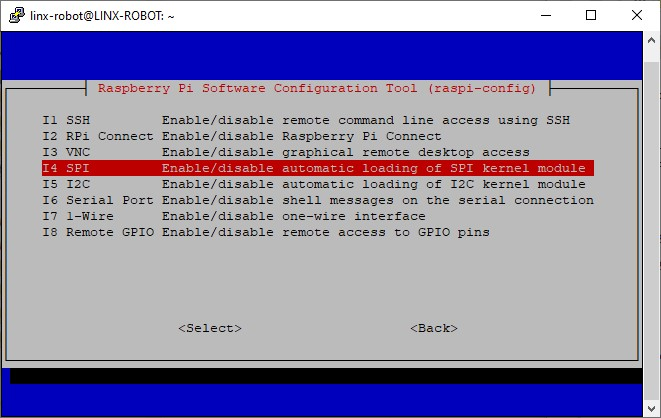

# 🚀 Guía de Configuración y Uso de Raspberry Pi

Este repositorio contiene una guía paso a paso para configurar y trabajar con una **Raspberry Pi**, desde la preparación del sistema operativo hasta la conexión remota y el uso de hardware adicional.  

---

## 📑 Tabla de Contenido

- [📂 Sección 1: Configuración básica](#-sección-1-configuración-básica)  
  - [1️⃣ Cargar Sistema Operativo en microSD](#1-cargar-sistema-operativo-en-microsd)  
  - [2️⃣ Conexión Remota a Raspberry Pi](#2-conexión-remota-a-raspberry-pi)  
  - [3️⃣ Habilitar Protocolos de Comunicación](#3-habilitar-protocolos-de-comunicación)
---

- [📂 Sección 2: Configuración Avanzada](#-sección-2-configuración-avanzada)  
  - [1️⃣ IP Fija](#1-ip-fija) 
  - [2️⃣ 2. Conexión con cable Ethernet](#2-conexión-con-cable-ethernet)   
---

## 📂 Sección 1: Configuración básica

### 1. Cargar Sistema Operativo en microSD

#### 📌 Requerimientos de Hardware
- 💻 Laptop  
- 💾 microSD con su adaptador  

⚠️ Estas instrucciones funcionan en **Windows** y **Linux**. Para **MacOS** aún está pendiente de probarse.  
Asegúrate de tener la microSD conectada a la computadora antes de iniciar.  

---

#### 🛠️ Instalación del Sistema Operativo
Para cargar el sistema operativo se utilizará **Raspberry Pi Imager**, que puede descargarse desde la [página oficial](https://www.raspberrypi.com/software/).  

Este software se encargará de **formatear y grabar el Sistema Operativo (SO)** en la microSD.  


En la ventana principal se deben seleccionar las siguientes opciones (con la microSD ya conectada):  

- **Dispositivo**: Raspberry Pi 5  
- **Sistema Operativo**: Raspberry Pi OS (64-Bit)  
- **Almacenamiento**: Ruta de la microSD *(se detecta automáticamente)*  

✅ Luego dar clic en **Siguiente**  
Se desplegará una ventana preguntando por la configuración personalizada del Sistema Operativo (SO). Para editarlos se selecciona *EDITAR AJUSTES* 


---

#### ⚙️ Ajustes de Personalización del SO
Al seleccionar esta opción se abrirá una ventana con **tres menús de configuración**:  

**1. General**
- Nombre de anfitrión: `LINX-ROBOT`  
- Usuario: `linx-robot`  
- Contraseña: `***********`  
- Configuración LAN inalámbrica:  
  - **SSID**: `NombreDeRed`  
  - **Contraseña**: `***********`  
  - Conexión automática al arrancar  
- Ajustes Regionales:  
  - Zona Horaria: `America/Mex_City`  
  - Distribución del teclado: `us` *(opcional)*  


**2. Servicio**
- Activar SSH  
- Usar autenticación por contraseña  

**3. Opciones**
- Reproducir sonido *(opcional)*  


---

🔧 Con esto la microSD queda lista para insertarse en la **Raspberry Pi** y arrancar el sistema operativo.  


---

### 2. Conexión remota a Raspberry Pi

#### 📌 Requerimientos de Hardware
- 💻 Laptop  
- 🍓 Raspberry Pi con Sistema Operativo cargado en microSD  
- 🔌 Cargador Raspberry Pi  
- 🖱️ Periféricos (opcional, recomendado para la primera configuración):  
  - Cable micro HDMI → HDMI  
  - Ratón USB Tipo A  
  - Teclado USB Tipo A  

---

#### 🌐 Métodos de conexión
Trabajar con Raspberry Pi suele ser tan sencillo como conectarla a un monitor utilizando un cable micro HDMI a HDMI y conectarle un raton y teclado por USB-A. Sin embargo, para aplicaciones donde la Raspberry Pi no estará conectada a algun monitor, lo mas recomendable es conectarse utilizando protocolo SSH.

Existen Dos formas principales de conectarse a la Raspberry Pi:  

1. **Ethernet** → Permite trabajar con Conexion de área local (LAN)
2. **WIFI**→ Permite conectarse remotamente a la **consola** de Raspberry Pi.  

Y para poder trabajar con Raspberry Pi se recomiendan estas aplicaciones:

1. **PuTTY** → Permite ver y controla la terminal.
2. **RealVNC** → Permite ver y controlar el **entorno gráfico**. 

---

#### 📡 Dirección IP
La **dirección IP** es un conjunto de números que indican como dirección para poder encontrar la Raspberry Pi y poderse conectar a ella de manera remota. Ejemplo: *192.168.0.1*

Por defecto la direccion IP viene dada por el Host Name que se colocó en el *Raspberry Pi Imager* pero la configuración de la red utilizando **Network Manager** afectará el uso del Host Name, por ende este solo podrá usarse para las configuraciones iniciales.

⚠️ **Nota**:  
- La IP puede cambiar en cada reinicio, aunque es posible configurar una **IP fija**.  
- Si deseas conocer la IP de manera remota, deberás estar en la misma red WiFi y utilizar un escaer de red (ejemplo *Angry IP Scanner*) lo cual puede ser difícil si hay varios dispositivos conectados.  

---

#### 🔑 Conexión con PuTTY
PuTTY permite el acceso remoto a una terminal mediante protocolo SSH pero tiene otros modos para conectarse. Aprovecharemos que configuramos la conexión WIFI por lo que esta configuración debera realizarse en la misma red WIFI.

1. Abrir **PuTTY** en la PC.  
2. En el campo **Hostname (IP address)** ingresa el Host Name o la dirección IP de la Raspberry Pi.
3. En **Connection type**, seleccionar **SSH**.  
4. Dejar las demás configuraciones por defecto y hacer clic en **Open**.  
5. En la consola que aparece se coloca el usuario de Raspberry Pi y la constraseña:
   - **Login as**: `linx-robot`  
   - **Password**: `***********`  

✅ Ahora se tiene acceso a la **Terminal de Raspberry Pi** desde la PC.  


---

#### 🖥️ Conexión con RealVNC
Para poder conectarse con **RealVNC**, primero es necesario habilitar el servidor VNC en la Raspberry Pi.  

1. Acceder a la terminal localmente o mediante PuTTY.  
2. Ejecutar:  

```bash
sudo raspi-config
```
3. Entrar al menú de configuración y seleccionar:  
   - **Interface Options → VNC → Enable**  

📷 *Espacio para imagen de habilitación de VNC en raspi-config*  

4. Abrir **RealVNC Viewer** en la PC:  
   - En la barra de búsqueda ingresar la **IP de la Raspberry Pi**.  
   - Ingresar **usuario** y **contraseña**.  

📷 *Espacio para imagen de conexión en RealVNC Viewer*  

⚡ Con esta configuración básica ya es posible conectarse de manera **remota** a la Raspberry Pi usando:  
- **Terminal (SSH con PuTTY)**  
- **Entorno gráfico (VNC con RealVNC)**  

---

### 3. Habilitar Protocolos de Comunicación

#### 📌 Requerimientos de Hardware
- 💻 Laptop  
- 🍓 Raspberry Pi conectada a la corriente  

**Periféricos opcionales** (para conexión local):  
- Cable micro HDMI → HDMI  
- Ratón USB Tipo A  
- Teclado USB Tipo A  

---

#### ⚙️ Activación de protocolos
Por defecto, la Raspberry Pi tiene inhabilitados algunos protocolos de comunicación.  
Para activarlos, ingresar a la terminal (local o remota) y ejecutar:  

```bash
sudo raspi-config
```
Se mostrará la interfaz de configuración. Debemos:  

1. Seleccionar **Interface Options**  
2. Aparecerá una lista de protocolos de telecomunicaciones disponibles:  
   - SSH Server *(Opcional)*
   - Raspberry Pi Connect *(Opcional)*
   - SPI  
   - VNC  
   - I2C  
   - Serial Port  
   - 1-Wire  
   - Remote GPIO  



3. Ingresar a cada protocolo que se quiera habilitar y seleccionar **Enable**.  

---

#### ✅ Finalización
- Una vez configurados todos los protocolos deseados, seleccionar **Finish**.  
- Si se solicita, realizar un **Reboot** para aplicar los cambios.  


Con esto, la Raspberry Pi queda lista para utilizar todos los **protocolos de comunicación habilitados**.

---
## 📂 Sección 2: Configuración Avanzada

### 1. IP Fija

Para asignar una **IP fija** a tu Raspberry Pi usando `nmtui` (Network Manager Text User Interface), sigue estos pasos:

1. Abre la terminal en tu Raspberry Pi (localmente o por SSH).
2. Ejecuta el siguiente comando para abrir el asistente de configuración de red:
   ```bash
   sudo nmtui
   ```
3. Selecciona la opción **"Edit a connection"** y elige la interfaz de red que deseas configurar (por ejemplo, `wlan0` para WiFi o `eth0` para Ethernet).
4. En el campo **"IPv4 CONFIGURATION"**, cambia el método de `Automatic (DHCP)` a `Manual`.
5. Añade la dirección IP deseada, la máscara de red y la puerta de enlace (gateway). Ejemplo:
   - **Address**: `192.168.1.50/22`
   - **Gateway**: `192.168.1.1`
6. (Opcional) Agrega los servidores DNS si lo requieres.
7. Guarda los cambios y selecciona **"Back"**.
8. Reinicia la interfaz de red o la Raspberry Pi para aplicar los cambios:
   ```bash
   sudo systemctl restart NetworkManager
   ```
   o simplemente reinicia con:
   ```bash
   sudo reboot
   ```

📷 *Espacio para imagen de menú principal de nmtui*  
📷 *Espacio para imagen de edición de conexión y configuración manual de IP*  

---

### 2. Conexión con cable Ethernet

Para conectar tu Raspberry Pi a internet mediante un cable Ethernet, sigue estos pasos:

1. Conecta un extremo del cable Ethernet al puerto Ethernet de tu Raspberry Pi y el otro extremo a un puerto libre de tu router o switch de red.
2. La Raspberry Pi debería detectar automáticamente la conexión. Para verificar, puedes usar el comando:
   ```bash
   ip a
   ```
   Busca una interfaz llamada `eth0` y verifica que tenga una dirección IP asignada.

📷 *Espacio para imagen de conexión por cable Ethernet*  

---

### 3. Cargar Script

Para cargar un script en tu Raspberry Pi, sigue estos pasos:

1. Transfiere el archivo del script a tu Raspberry Pi usando SCP, SFTP o un dispositivo USB.
2. Navega hasta el directorio donde se encuentra el script.
3. Asegúrate de que el script tenga permisos de ejecución. Si no, otórgale permisos con el comando:
   ```bash
   chmod +x nombre_del_script.sh
   ```
4. Ejecuta el script con el comando:
   ```bash
   ./nombre_del_script.sh
   ```

📷 *Espacio para imagen de transferencia y ejecución de script*  

---

### 4. Sensores y Hardware

Para conectar y configurar sensores u otro hardware en tu Raspberry Pi, sigue estos pasos generales:

1. Apaga tu Raspberry Pi y desconéctala de la corriente.
2. Conecta el sensor o hardware en los pines GPIO correspondientes. Consulta la documentación del sensor y de la Raspberry Pi para conocer los pines correctos.
3. Vuelve a conectar y encender tu Raspberry Pi.
4. Instala las bibliotecas o controladores necesarios para el sensor o hardware que estás utilizando.
5. Escribe un script o programa para interactuar con el sensor o hardware. Consulta la documentación específica para conocer los comandos y funciones disponibles.

📷 *Espacio para imagen de conexión y configuración de sensores*  
