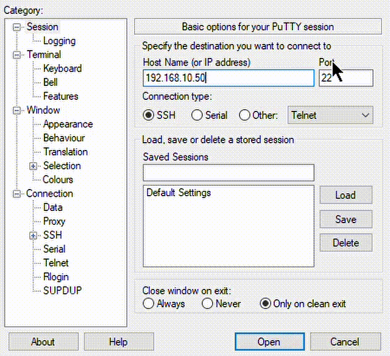
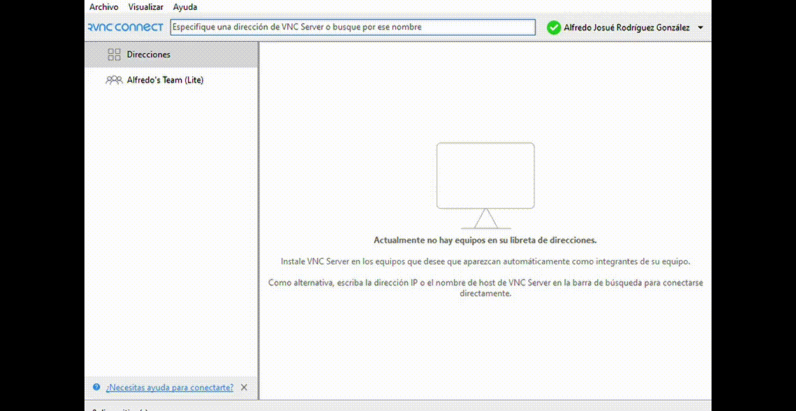

# 📂 Sección 1: Configuración básica

- [📂 Sección 1: Configuración básica](#-sección-1-configuración-básica)
  - [💾 Cargar Sistema Operativo en microSD](#-cargar-sistema-operativo-en-microsd)
    - [📌 Requerimientos de Hardware](#-requerimientos-de-hardware)
    - [🛠️ Instalación del Sistema Operativo](#️-instalación-del-sistema-operativo)
    - [⚙️ Ajustes de Personalización del SO](#️-ajustes-de-personalización-del-so)
      - [**1. General**](#1-general)
      - [**2. Servicio**](#2-servicio)
      - [**3. Opciones**](#3-opciones)
  - [🔗 Conexión remota a Raspberry Pi](#-conexión-remota-a-raspberry-pi)
    - [📌 Requerimientos de Hardware](#-requerimientos-de-hardware-1)
    - [🌐 Métodos de conexión](#-métodos-de-conexión)
    - [📡 Dirección IP](#-dirección-ip)
    - [🔑 Conexión con PuTTY](#-conexión-con-putty)
    - [🖥️ Conexión con RealVNC](#️-conexión-con-realvnc)
  - [📡 Habilitar Protocolos de Comunicación](#-habilitar-protocolos-de-comunicación)
    - [📌 Requerimientos de Hardware](#-requerimientos-de-hardware-2)
    - [⚙️ Activación de protocolos](#️-activación-de-protocolos)
    - [✅ Finalización](#-finalización)

## 💾 Cargar Sistema Operativo en microSD

### 📌 Requerimientos de Hardware

- 💻 Laptop  
- 💾 microSD con su adaptador  

⚠️ Estas instrucciones funcionan en **Windows** y **Linux**. Para **MacOS** aún está pendiente de probarse.  
Asegúrate de tener la microSD conectada a la computadora antes de iniciar.  

---

### 🛠️ Instalación del Sistema Operativo

Para cargar el sistema operativo se utilizará **Raspberry Pi Imager**, que puede descargarse desde la [página oficial](https://www.raspberrypi.com/software/).  

Este software se encargará de **formatear y grabar el Sistema Operativo (SO)** en la microSD.  


En la ventana principal se deben seleccionar las siguientes opciones (con la microSD ya conectada):  

- **Dispositivo**: Raspberry Pi 5  
- **Sistema Operativo**: Raspberry Pi OS (64-Bit)  
- **Almacenamiento**: Ruta de la microSD *(se detecta automáticamente)*  

✅ Luego dar clic en **Siguiente**  
Se desplegará una ventana preguntando por la configuración personalizada del Sistema Operativo (SO). Para editarlos se selecciona *EDITAR AJUSTES*


---

### ⚙️ Ajustes de Personalización del SO

Al seleccionar esta opción se abrirá una ventana con **tres menús de configuración**:  

#### **1. General**

- Nombre de anfitrión: `LINX-ROBOT`  
- Usuario: `linx-robot`  
- Contraseña: `***********`  
- Configuración LAN inalámbrica:  
  - **SSID**: `NombreDeRed`  
  - **Contraseña**: `***********`  
  - Conexión automática al arrancar  
- Ajustes Regionales:  
  - Zona Horaria: `America/Mex_City`  
  - Distribución del teclado: `us` *(opcional)*  


#### **2. Servicio**

- Activar SSH  
- Usar autenticación por contraseña  


#### **3. Opciones**

- Reproducir sonido *(opcional)*  


---

🔧 Con esto la microSD queda lista para insertarse en la **Raspberry Pi** y arrancar el sistema operativo.  


---

## 🔗 Conexión remota a Raspberry Pi

### 📌 Requerimientos de Hardware

- 💻 Laptop  
- 🍓 Raspberry Pi con Sistema Operativo cargado en microSD  
- 🔌 Cargador Raspberry Pi  
- 🖱️ Periféricos (opcional, recomendado para la primera configuración):  
  - Cable micro HDMI → HDMI  
  - Ratón USB Tipo A  
  - Teclado USB Tipo A  

---

### 🌐 Métodos de conexión

Trabajar con Raspberry Pi suele ser tan sencillo como conectarla a un monitor utilizando un cable micro HDMI a HDMI y conectarle un raton y teclado por USB-A. Sin embargo, para aplicaciones donde la Raspberry Pi no estará conectada a algun monitor, lo mas recomendable es conectarse utilizando protocolo SSH.

Existen Dos formas principales de conectarse remotamente a la Raspberry Pi:  

1. **Ethernet** → Permite trabajar con Conexion de área local (LAN)
2. **WIFI**→ Permite conectarse remotamente a la **consola** de Raspberry Pi.  

Y para poder trabajar con Raspberry Pi se recomiendan estas aplicaciones:

1. **PuTTY** → Permite ver y controla la terminal.
2. **RealVNC** → Permite ver y controlar el **entorno gráfico**.
3. **VSCode** → Permite ver la terminal y el arbol de directorios [*Configuración intermedia*](Seccion_2.md#-conexión-por-vscode)

---

### 📡 Dirección IP

La **dirección IP** es un conjunto de números que indican como dirección para poder encontrar la Raspberry Pi y poderse conectar a ella de manera remota. Ejemplo: *192.168.0.1/24*

Por defecto la direccion IP viene dada por el Host Name que se colocó en el *Raspberry Pi Imager* pero la configuración de la red utilizando **Network Manager** afectará el uso del Host Name, por ende este solo podrá usarse para las configuraciones iniciales.

⚠️ **Nota**:  

- La IP puede cambiar en cada reinicio, aunque es posible configurar una [**IP fija**](Seccion_2.md#-ip-fija).
- Si deseas conocer la IP de manera remota, deberás estar en la misma red WiFi y utilizar un escaer de red (ejemplo *Angry IP Scanner*) lo cual puede ser difícil si hay varios dispositivos conectados.  

Dependiendo si tu conexion es a traves de wifi, ethernet o Hostpot deberas o no crear una **ip fija** para ese dispositivo y eso dependera si existen o no varios dispositivos en la red.

Recomendamos leer la sección [**Ip Fija**](Seccion_2.md#-ip-fija) para configurar usando `nmtui`

---

### 🔑 Conexión con PuTTY

PuTTY permite el acceso remoto a una terminal mediante protocolo SSH pero tiene otros modos para conectarse. Aprovecharemos que configuramos la conexión WIFI por lo que esta configuración debera realizarse en la misma red WIFI.

1. Abrir **PuTTY** en la PC.  
2. En el campo **Hostname (IP address)** ingresa el Host Name o la dirección IP de la Raspberry Pi.
3. En **Port** usa el puerto 22 (conexión SSH).
4. En **Connection type**, seleccionar **SSH**.  
5. Dejar las demás configuraciones por defecto y hacer clic en **Open**.  
6. En la consola que aparece se coloca el usuario de Raspberry Pi y la constraseña:
   - **Login as**: `linx-robot`  
   - **Password**: `***********`  

✅ Ahora se tiene acceso a la **Terminal de Raspberry Pi** desde la PC.  




---

### 🖥️ Conexión con RealVNC

Para poder conectarse con **RealVNC**, primero es necesario habilitar el servidor VNC en la Raspberry Pi. Lo mas recomendable es hacer esto desde PuTTY o localmente.

1. Acceder a la terminal localmente o mediante PuTTY.  
2. Ejecutar:  

  ```bash
  sudo raspi-config
  ```

3. Entrar al menú de configuración y seleccionar:

**Interface Options → VNC → Enable**  


4. Abrir **RealVNC Viewer** en la PC:

- En la barra de búsqueda ingresar la **IP de la Raspberry Pi**.  
- Ingresar **usuario** y **contraseña**.  



⚡ Con esta configuración básica ya es posible conectarse de manera **remota** a la Raspberry Pi usando:  

- **Terminal (SSH con PuTTY)**  
- **Entorno gráfico (VNC con RealVNC)**  

---

## 📡 Habilitar Protocolos de Comunicación

### 📌 Requerimientos de Hardware

- 💻 Laptop  
- 🍓 Raspberry Pi conectada a la corriente  

**Periféricos opcionales** (para conexión local):

- Cable micro HDMI → HDMI  
- Ratón USB Tipo A  
- Teclado USB Tipo A  

---

### ⚙️ Activación de protocolos

Por defecto, la Raspberry Pi tiene inhabilitados algunos protocolos de comunicación.  
Para activarlos, ingresar a la terminal (local o remota) y ejecutar:  

```bash
sudo raspi-config
```

Se mostrará la interfaz de configuración. Debemos:  

1. Seleccionar **Interface Options**  
2. Aparecerá una lista de protocolos de telecomunicaciones disponibles:  
   - SSH Server
   - Raspberry Pi Connect
   - SPI  
   - VNC  
   - I2C  
   - Serial Port  
   - 1-Wire  
   - Remote GPIO  


1. Ingresar a cada protocolo que se quiera habilitar y seleccionar **Enable**.  

---

### ✅ Finalización

- Una vez configurados todos los protocolos deseados, seleccionar **Finish**.  
- Si se solicita, realizar un **Reboot** para aplicar los cambios.  

Con esto, la Raspberry Pi queda lista para utilizar todos los **protocolos de comunicación habilitados**.
