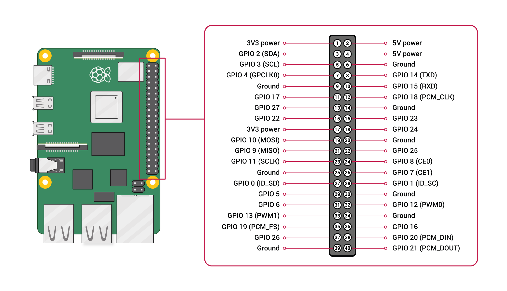

# 📂 Sección 2: Configuración Intermedia

- [📂 Sección 2: Configuración Intermedia](#-sección-2-configuración-intermedia)
  - [🌐 Redes y Conexiones](#-redes-y-conexiones)
    - [🔢 IP Fija](#-ip-fija)
    - [🔌 Conexión con cable Ethernet](#-conexión-con-cable-ethernet)
    - [💻 Conexión por VSCode](#-conexión-por-vscode)
    - [📶 Hostpot](#-hostpot)
  - [📜 Scripts](#-scripts)
    - [📚 Librerías de python](#-librerías-de-python)
    - [⚙️ apt vs pip](#️-apt-vs-pip)
      - [🔧 `apt` → nivel del sistema operativo](#-apt--nivel-del-sistema-operativo)
      - [🐍 `pip` → nivel de Python](#-pip--nivel-de-python)
      - [⚠️ Recomendaciones prácticas (especialmente en Raspberry Pi)](#️-recomendaciones-prácticas-especialmente-en-raspberry-pi)
      - [🧠 En resumen](#-en-resumen)
    - [🐍 Virtual Enviroments en Python](#-virtual-enviroments-en-python)
    - [⚙️ Cargar Script](#️-cargar-script)
  - [🔧 Sensores y Hardware](#-sensores-y-hardware)
    - [🔌 Biblioteca GPIO](#-biblioteca-gpio)
    - [🌅 Script al arrancar Raspberry Pi](#-script-al-arrancar-raspberry-pi)

## 🌐 Redes y Conexiones

### 🔢 IP Fija

Para asignar una **IP fija** a tu Raspberry Pi usando `nmtui` (Network Manager Text User Interface), sigue estos pasos:

1. Abre la terminal en tu Raspberry Pi (localmente o por SSH).
2. Instala *Network Manager*:

   ```bash
   sudo apt install network-manager
   ```

3. Ejecuta el siguiente comando para abrir el asistente de configuración de red:

   ```bash
   sudo nmtui
   ```

4. Selecciona la opción **"Edit a connection"** y elige la interfaz de red que deseas configurar (por ejemplo, `wlan0` para WiFi o `eth0` para Ethernet).
5. En el campo **"IPv4 CONFIGURATION"**, cambia el método de `Automatic (DHCP)` a `Manual`.
6. Añade la dirección IP deseada, la máscara de red y la puerta de enlace (gateway). Ejemplo:
   - **Address**: `192.168.1.50/24`
   - **Gateway**: `192.168.1.1`
7. (Opcional) Agrega los servidores DNS si lo requieres.
8. Guarda los cambios y selecciona **"Back"**.
9. Reinicia la interfaz de red o la Raspberry Pi para aplicar los cambios:

   ```bash
   sudo systemctl restart NetworkManager
   ```

   o simplemente reinicia con:

   ```bash
   sudo reboot
   ```

Algunas opciones para IPs:

- WIFI:  `192.168.10.50/24`
- Ethernet: `192.168.1.50/24`
- Hostpot: `192.168.4.1/24`
- Colmena: `192.168.10.1/24`


📷 *Espacio para imagen de menú principal de nmtui*  
📷 *Espacio para imagen de edición de conexión y configuración manual de IP*  

---

### 🔌 Conexión con cable Ethernet

Para conectar tu Raspberry Pi a internet mediante un cable Ethernet, sigue estos pasos:

1. Conecta un extremo del cable Ethernet al puerto Ethernet de tu Raspberry Pi y el otro extremo a un puerto libre de tu router o switch de red.
2. La Raspberry Pi debería detectar automáticamente la conexión. Para verificar, puedes usar el comando:

   ```bash
   ip a
   ```

   Busca una interfaz llamada `eth0` y verifica que tenga una dirección IP asignada.

📷 *Espacio para imagen de conexión por cable Ethernet*  

### 💻 Conexión por VSCode

Para quitar una llave asociada a algun Host SSH, en `powershell`:

```powershell
ssh-keygen -R <hostname/ip>
```

Si eso no funciona se puede ir a la carpeta `.ssh` y borrar el contenido de `known_hosts` y `known_hosts.old`. A veces se cambia de llave SSH y VSCode reconoce ese cambio como un *man in the middle*.

### 📶 Hostpot

Para configurar un Hostpot lo mas facil es directo desde Raspberry Pi utilizando el escritorio. Para ello se puede utilizar un cable HDMI o un escritorio virtual con RealVNC. Una vez en el escritorio remoto.

Para conectarse a una red especifica:
```bash
sudo nmcli connection up "nombre-de-red"
```

Para desconectarse:
```bash
sudo nmcli connection down "nombre-de-red"
```

Para conectarse a una red por defecto.

```bash
sudo nmcli connection modify "nombre-de-red" connection.autoconnect yes
```

## 📜 Scripts

### 📚 Librerías de python

Python es el lenguaje más utilizado en Raspberry Pi para automatización, robótica y control de hardware.  Antes de comenzar a escribir scripts, es importante conocer y gestionar correctamente las librerías necesarias.

Las **librerías** (o módulos) son colecciones de código que amplían las capacidades de Python.  
Permiten controlar los pines GPIO, interactuar con sensores, realizar cálculos matemáticos, manejar redes, entre otros.

Ejemplo de librerías comunes en Raspberry Pi:

| Librería | Descripción | Uso típico |
|-----------|--------------|------------|
| `gpiozero` | Abstracción sencilla para controlar pines GPIO. | Encender LEDs, leer sensores, controlar motores. |
| `rpi-lgpio` | Interfaz moderna y compatible con Raspberry Pi 5 para manejo de GPIO. | Control preciso de pines digitales. |
| `RPi.GPIO` | Librería clásica de Raspberry Pi (ahora reemplazada por `rpi-lgpio`). | Scripts heredados o versiones anteriores. |
| `time` | Control de temporización en scripts. | Retardos, bucles de espera. |
| `os` | Interacción con el sistema operativo. | Acceso a rutas, ejecución de comandos. |
| `sys` | Control de argumentos y salida del programa. | Integración con servicios del sistema. |


### ⚙️ apt vs pip

Tanto `apt` como `pip` sirven para **instalar software**, pero trabajan en **niveles diferentes del sistema**:

| Herramienta | Nivel del sistema | Qué instala | Fuente | Ejemplo de uso |
|--------------|------------------|--------------|---------|----------------|
| **`apt` (Advanced Package Tool)** | Sistema operativo (nivel global) | Programas completos, dependencias del sistema y librerías C/C++ necesarias para Python u otros lenguajes. | Repositorios oficiales de Debian/Raspberry Pi OS. | `sudo apt install python3-gpiozero` |
| **`pip` (Python Package Installer)** | Entorno de Python (global o virtual) | Paquetes y módulos escritos en Python (no programas del sistema). | Repositorio oficial de Python: [PyPI.org](https://pypi.org) | `pip install gpiozero` |

---

#### 🔧 `apt` → nivel del sistema operativo

`apt` instala software gestionado por el **gestor de paquetes del sistema (Debian)**.  
Instalar algo con `apt` implica modificar archivos en directorios del sistema, como `/usr/lib` o `/usr/bin`. Usa `sudo` para poder instalarlas globalmente.

Ejemplo:
```bash
sudo apt install python3-gpiozero
```

Esto instala:
- El **intérprete de Python** (si no está instalado).
- El **paquete gpiozero** desde los repositorios de Raspberry Pi.
- Todas las **dependencias de sistema** necesarias (por ejemplo, drivers o librerías C subyacentes).

**Ventajas:**
- Alta estabilidad: los paquetes fueron probados para tu versión del sistema operativo.
- Integración con el sistema: útil para scripts que se ejecutan al arrancar la Raspberry Pi.

**Desventajas:**
- Suele traer versiones más antiguas.
- No siempre incluye las últimas actualizaciones de PyPI.

---

#### 🐍 `pip` → nivel de Python

`pip` instala paquetes directamente desde el **repositorio de Python (PyPI)**.  
Actúa dentro del entorno de Python (ya sea el del sistema o uno virtual con `venv`). No se necesita usar `sudo` dentro de [ambientes virtuales](#-virtual-enviroments-en-python).

Ejemplo:

```bash
pip install gpiozero
```

Esto descarga el paquete más reciente directamente desde Internet y lo instala en:
- `~/.local/lib/python3.x/site-packages` (usuario actual), o  
- dentro del [entorno virtual](#-virtual-enviroments-en-python) (`.venv/lib/...`) si lo usas.

**Ventajas:**
- Acceso a las **últimas versiones**.
- Puedes usarlo en entornos aislados (sin afectar al sistema).
- Ideal para proyectos o desarrollo.

**Desventajas:**
- No gestiona dependencias del sistema (si una librería depende de código C, puede fallar).
- Puede entrar en conflicto con versiones instaladas por `apt`.

---

#### ⚠️ Recomendaciones prácticas (especialmente en Raspberry Pi)

1. **Usa `apt` para instalar Python y librerías del sistema**, por ejemplo:
   ```bash
   sudo apt install python3 python3-venv python3-pip python3-gpiozero
   ```

2. **Usa `pip` para instalar paquetes adicionales de PyPI**, especialmente en entornos virtuales:
   ```bash
   python3 -m venv .venv
   source .venv/bin/activate
   pip install numpy matplotlib
   ```

3. **Evita mezclar `sudo pip` con `apt`**  
   Esto puede sobrescribir paquetes del sistema y causar errores como:
   ```
   ImportError: cannot import name 'xyz' from partially initialized module
   ```

4. Si realmente necesitas instalar algo globalmente (por ejemplo, para scripts del sistema):
   ```bash
   sudo pip install --break-system-packages nombre_paquete
   ```
   pero **solo si sabes lo que haces** y documentas el motivo.

Se recomienda en nuestro caso instalar las librerias en un [ambiente virtual](#-virtual-enviroments-en-python) utilizando `pip` pero habrá librerías que se deberan instalar globalmente para construir las usadas en el ambiente virtual. Esas librerías necesarias deberán ser instaladas usando  `apt`.

#### 🧠 En resumen

| Criterio | `apt` | `pip` |
|-----------|--------|--------|
| Nivel de instalación | Sistema operativo | Entorno de Python |
| Fuente | Repositorios de Debian/Raspberry Pi OS | PyPI (Python Package Index) |
| Actualizaciones | Lentas pero seguras | Rápidas, versión más reciente |
| Seguridad | Alta, probado por la distro | Depende del paquete |
| Recomendado para | Librerías del sistema y Python base | Paquetes adicionales y desarrollo |


### 🐍 Virtual Enviroments en Python

Para crear ambientes que puedan acceder a las librerias del sistema

```bash
python3 -m venv --system-site-packages .venv
```

Donde `.venv` es el nombre del ambiente, puede ser cambiado pero no se recomienda por simplicidad, a menos que necesites varios ambientes. El flag `--system-site-packages` permite que el ambiente virtual pueda usar las bibliotecas globales, es decir las instaladas con `sudo apt`.

 Para activar el virtual enviroment `.venv`:

```bash
source .venv/bin/activate
```

Para desactivar un virtual enviroment:

```bash
deactivate
```

Una buena practica para poder compartir el codigo es dar las librerias instaladas y su respectiva versión. Dentro de un ambiente solo se cargarán aquellas a las que pueda acceder `pip`:

```bash
pip freeze > requirements.txt
```

Esto crea un archivo `requirements.txt` en el directorio de trabajo actual. Con eso se pueden exportar las listas de las librerias instaladas, para instalarlas se puede usar:

```bash
pip install -r requirements.txt
```

Cabe resaltar que, con este metodo, habra librerias que no podran importarse en el `.venv` adecuadamente, po lo que se recomienda en nuestro caso [instalar las librerías](#-pip--nivel-de-python) en un ambiente virtual utilizando `pip` pero habrá librerías que se deberan [instalar globalmente](#-apt--nivel-del-sistema-operativo) para construir las usadas en el ambiente virtual. Esas librerías necesarias deberán ser instaladas usando  `apt`.


### ⚙️ Cargar Script

Para cargar un script en tu Raspberry Pi, sigue estos pasos:

1. Transfiere el archivo del script a tu Raspberry Pi usando SCP, SFTP o un dispositivo USB.
2. Navega hasta el directorio donde se encuentra el script.
3. Asegúrate de que el script tenga permisos de ejecución. Si no, otórgale permisos con el comando:

   ```bash
   chmod +x nombre_del_script.sh
   ```

4. Ejecuta el script con el comando:

   ```bash
   ./nombre_del_script.sh
   ```

   Si es de python:

📷 *Espacio para imagen de transferencia y ejecución de script*  

---

## 🔧 Sensores y Hardware

Para conectar y configurar sensores u otro hardware en tu Raspberry Pi, sigue estos pasos generales:

1. Apaga tu Raspberry Pi y desconéctala de la corriente.
2. Conecta el sensor o hardware en los pines GPIO correspondientes. Consulta la documentación del sensor y de la Raspberry Pi para conocer los pines correctos.
3. Vuelve a conectar y encender tu Raspberry Pi.
4. Instala las bibliotecas o controladores necesarios para el sensor o hardware que estás utilizando.
5. Escribe un script o programa para interactuar con el sensor o hardware. Consulta la documentación específica para conocer los comandos y funciones disponibles.

### 🔌 Biblioteca GPIO

Un usuario se puede conectar a los pines de la Raspberri Pi mediante su número fisico o su número BCM (*Broadcom SOC channel number*)



Para viejas versiones de Raspberry Pi se utilizaba por defecto la biblioteca `RPi.GPIO` que es una *Biblioteca de Backend* que accede a los registros de hardware para controlar los pines por ejemplo.

Pero estos dependen bastante del hardware en el que esta implementado y en Raspberry Pi 5 el hardware es diferente, con el GPIO gestionado por el chip RPI1, que no es compatible con las Pi anteriores. Por lo que se recomienda que se acceda a los pines mediante el kernel de Linux.

Se recomienda en **Raspberry Pi 5** remover la libreria `RPi.GPIO` para evitar conflictos:

```bash
sudo apt unistall RPi.GPIO
```

Para poder acceder al GPIO se pueden utilizar las siguientes bibliotecas en todo el sistema, es decir, no pueden ser compiladas dentro de un [virtual enviroment](#-virtual-enviroments-en-python):

- `rpi-lgpio`: debe instalarse en toda la Raspberry Pi utilizando

   ```bash
   sudo apt install python3-rpi-lgpio
   ```

  y **NO** debe estar instalada la biblioteca RPi.GPIO

- `gpiozero`: contiene *RPi.GPIO* y *rpi-lgpio*, se recomienda esta opcion por compatibilidad con `lgpio` de backend
  
   ```bash
   sudo apt install gpiozero
   ```

Con esto la libreria GPIO queda configurada para usar el kernel de Linux como intermediario. Aunque es mas rapido utilizar `RPi.GPIO` ya que es mucho más rápido trabajar directamente con el Hardware que pedirle al controlador del dispositivo del kernel que lo haga. Sin embargo, no ofrecen protección contra el acceso concurrente y pueden entrar en conflicto entre sí, entre sí mismas y con las bibliotecas que usan el kernel.

### 🌅 Script al arrancar Raspberry Pi

Para ello necesitamos tener un script de python. Adicionalmente se puede tener un viertual enviroment asociado.

Primero se deben conceder los permisos:

```bash
chmod +x <nombre-del-archivo>
```

📷 *Espacio para imagen*  

Luego, se cambia al directorio del Sistema donde estan los servicios:

```bash
cd /lib/systemd/system
```

Ahí habrán muchos archivos tipo `.service`. Para iniciar un script durante el arranque vamos a crear un nuevo servicio:

```bash
sudo touch nombre-del-servicio.service
```

Se recomienda el uso de Nano para poder editar el archivo con permisos de administrador:

```bash
sudo nano nombre-del-servicio.service
```

Dentro se debe colocar lo siguiente

```text
[Unit]
Description=Descripcion del servicio
After=multi-user.target

[Service]
Type=simple
ExecStart=/usr/bin/python3 /directorio/de/archivo.py
WorkingDirectory=/directorio/del/proyecto
User=linx-robot
Restart=on-failure
RestartSec=5

[Install]
WantedBy=multi-user.target
```

Donde:

- **Unit** Define la información general del servicio y sus dependencias con otros procesos o estados del sistema.
  - **Description** Texto descriptivo que indica qué hace el servicio.
  - **After** Indica cuándo debe iniciarse el servicio respecto a otros.
- **Service** Contiene la configuración principal de ejecución del servicio, indicando qué comando se ejecuta y bajo qué condiciones.
  - **Type** Define cómo se comporta el servicio.
  - **ExecStart** Comando que ejecutará el servicio.
  - **WorkingDirectory** Directorio de trabajo desde el cual se ejecuta el servicio (opcional, pero recomendable si el script depende de rutas relativas).
  - **User** Usuario bajo el cual se ejecuta el servicio.
  - **Restart** Indica si el servicio debe reiniciarse automáticamente en caso de fallo.
    - `no` no reinicia.
    - `on-failure` reinicia solo si el proceso termina con error.
    - `always` reinicia siempre que el proceso se detenga.
  - **RestartSec** Tiempo (en segundos) que espera antes de intentar reiniciar el servicio.
- **Install** Indica cómo se integra el servicio con los objetivos (targets) del sistema, es decir, en qué momento o estado se habilitará.
  - **WantedBy** Define el target o “nivel de ejecución” en el que se habilita el servicio automáticamente. 
    - `multi-user.target` es el más común en sistemas Linux sin entorno gráfico, ya que equivale al arranque completo del sistema.

Comandos utiles en nano

- `ctrl + s` Guardar archivo
- `ctrl + x` Salir del archivo

Ahora, en el directorio local `~` se debe reiniciar el *daemon*, que es como se llama a un programa que se corre en segundo plano:

```bash
sudo systemctl daemon-reload
```

Probar el servicio:

```bash
sudo systemctl start nombre-del-servicio.service
```

Ver estado del servicio:

```bash
sudo systemctl status nombre-del-servicio.service
```

Habilitar el servicio.

```bash
sudo systemctl enable nombre-del-servicio.service
```

O habilitar e iniciar el servicio:

```bash
sudo systemctl enable --now blink_BCM.service
```

Para detener el servicio:

```bash
sudo systemctl stop nombre-del-servicio.service
```

Para desactivar el servicio:

```bash
sudo systemctl disable nombre-del-servicio.service
```

Forzar terminación (en caso de emergencia):

```bash
sudo systemctl kill nombre-del-servicio.service
```
