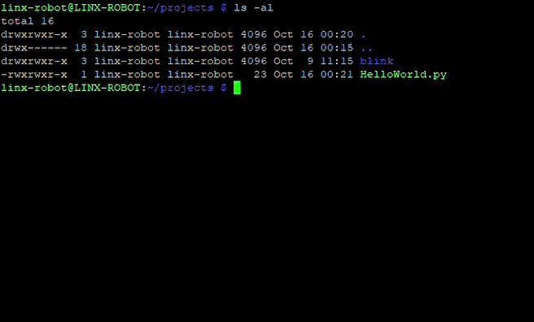

# Tutoriales

- [Tutoriales](#tutoriales)
  - [`HelloWorld.py`](#helloworldpy)
    - [🧰 Requerimientos del Sistema](#-requerimientos-del-sistema)
    - [📦 Dependencias Necesarias](#-dependencias-necesarias)
    - [🧪 Crear y Activar un Entorno Virtual (*Opcional*)](#-crear-y-activar-un-entorno-virtual-opcional)
    - [📁 Crear el Script `HelloWorld.py`](#-crear-el-script-helloworldpy)
    - [▶️ Ejecución del Script](#️-ejecución-del-script)
    - [🧾 Referencias](#-referencias)


Para los siguientes tutoriales puedes bajar el proyecto de GitHub clonando este repositorio, se sugiere ver el [Curso de Git y GitHub](https://github.com/LINX-ICN-UNAM/Curso-GIT-Github) para poder conectar la Raspberry Pi a **GitHub** por medio de **Git**. Para instalar `git` puedes usar los siguientes comandos:

```bash
sudo apt update
sudo apt install git
```

Tambien se necesitará `python 3` y su gestor de librerias `python pip`:

```bash
sudo apt update
sudo apt install python3 python3-pip
```

Por ultimo, se necesitarán los ambientes virtuales (*venv*) para poder contener las librerias y que no contaminen los demas proyectos.

```bash
sudo apt update
sudo apt install python3-venv
```

La otra opcion es descargar el script o ver su contenido y copiarlo y pegarlo en un archivo con la debida extension.

## `HelloWorld.py`

### 🧰 Requerimientos del Sistema

---

- **Hardware:** Raspberry Pi 4 o 5  
- **Sistema Operativo:** Raspberry Pi OS (64 bits recomendado)  
- **Acceso:** Por consola local, SSH o VS Code Remote SSH  
- **Conexión a Internet:** Requerida para instalar dependencias  

### 📦 Dependencias Necesarias

---

💡 Python 3 y pip vienen preinstalados en la mayoría de las imágenes oficiales de Raspberry Pi OS.
Si usas una versión personalizada o minimal, asegúrate de tenerlos.

### 🧪 Crear y Activar un Entorno Virtual (*Opcional*)

---

Usar un entorno virtual evita conflictos entre versiones de librerías.

```bash
# Crear un entorno virtual en el directorio del proyecto
python3 -m venv .venv

# Activar el entorno
source .venv/bin/activate
```

Para desactivar el entorno virtual en cualquier momento:

```bash
deactivate
```

### 📁 Crear el Script `HelloWorld.py`

---

Puedes clonar el repositorio con [este enlace](./script/HelloWorld.py) en tu carpeta de trabajo o puedes crear un archivo llamado `HelloWorld.py` utilizando en enlace y copiando el contenido del archivo.

Guarda el archivo en `/home/<usuario>/<projects>`

### ▶️ Ejecución del Script

---

Asegurate que tu script tenga [permisos de ejecución](Seccion_2.md#️-cargar-script). Desde el directorio donde está el archivo, ejecuta:

```bash
python3 HelloWorld.py
```

Si estás dentro del entorno virtual:

```bash
(.venv) python HelloWorld.py
```
Debeías ver lo siguiente:



Esto indica que `Python 3` se instaló correctamente. 

### 🧾 Referencias

---

- [Documentación oficial de Python en Raspberry Pi](https://www.raspberrypi.com/documentation/computers/using.html#using-python)
- [Systemd Service Units - Raspberry Pi OS](https://www.freedesktop.org/software/systemd/man/systemd.service.html)
- [Uso de Entornos Virtuales en Python](https://docs.python.org/3/library/venv.html)

---

🧠 **Tip:** Este flujo (instalar dependencias → crear venv → ejecutar script → crear .service) es el mismo que usarás más adelante para proyectos de robótica, automatización o control de hardware.

