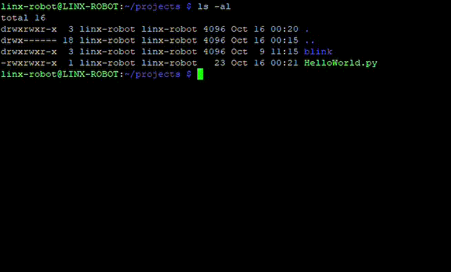
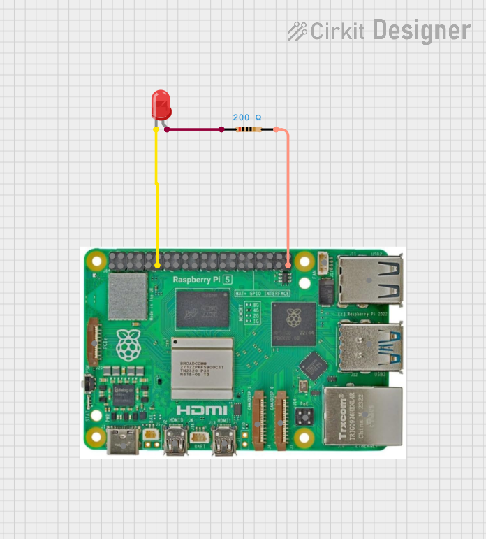

# 📚 Tutoriales

- [📚 Tutoriales](#-tutoriales)
- [✋ `HelloWorld.py`](#-helloworldpy)
  - [🧰 Requerimientos del Sistema](#-requerimientos-del-sistema)
  - [📦 Dependencias Necesarias](#-dependencias-necesarias)
  - [🧪 Crear y Activar un Entorno Virtual (*Opcional*)](#-crear-y-activar-un-entorno-virtual-opcional)
  - [📁 Crear el Script `HelloWorld.py`](#-crear-el-script-helloworldpy)
  - [▶️ Ejecución del Script](#️-ejecución-del-script)
  - [🧾 Referencias](#-referencias)
- [💡 `blink.py`](#-blinkpy)
  - [🧰 Requerimientos del Sistema](#-requerimientos-del-sistema-1)
  - [📦 Dependencias Necesarias](#-dependencias-necesarias-1)
  - [🧪 Crear y Activar un Entorno Virtual (*Opcional*)](#-crear-y-activar-un-entorno-virtual-opcional-1)
  - [📁 Crear el Script `blink.py`](#-crear-el-script-blinkpy)
  - [🛠 Conectar el Circuito](#-conectar-el-circuito)
  - [▶️ Ejecución del Script](#️-ejecución-del-script-1)
  - [🧾 Referencias](#-referencias-1)


Para los siguientes tutoriales puedes bajar el proyecto de GitHub clonando este repositorio, se sugiere ver el [Curso de Git y GitHub](https://github.com/LINX-ICN-UNAM/Curso-GIT-Github) para poder conectar la Raspberry Pi a **GitHub** por medio de **Git**. Para instalar `git` puedes usar los siguientes comandos:

```bash
sudo apt update
sudo apt install git
```

Tambien se necesitará `python 3` y su gestor de librerias `python pip`:

```bash
sudo apt update
sudo apt install python3 python3-pip
```

Por ultimo, se necesitarán los ambientes virtuales (*venv*) para poder contener las librerias y que no contaminen los demas proyectos.

```bash
sudo apt update
sudo apt install python3-venv
```

La otra opcion es descargar el script o ver su contenido y copiarlo y pegarlo en un archivo con la debida extension.

---

# ✋ `HelloWorld.py`
El programa más sencillo que se puede crear en Python. Con esto vamos a verificar que Python este instalado y que la Raspberry Pi puede correr scripts.


## 🧰 Requerimientos del Sistema

- **Hardware:** Raspberry Pi 4 o 5  
- **Sistema Operativo:** Raspberry Pi OS (64 bits recomendado)  
- **Acceso:** Por consola local, SSH o VS Code Remote SSH  
- **Conexión a Internet:** Requerida para instalar dependencias  

## 📦 Dependencias Necesarias

💡 Python 3 y pip vienen preinstalados en la mayoría de las imágenes oficiales de Raspberry Pi OS.
Si usas una versión personalizada o minimal, asegúrate de tenerlos.

## 🧪 Crear y Activar un Entorno Virtual (*Opcional*)

Usar un entorno virtual evita conflictos entre versiones de librerías.

```bash
# Crear un entorno virtual en el directorio del proyecto
python3 -m venv .venv

# Activar el entorno
source .venv/bin/activate
```

Para desactivar el entorno virtual en cualquier momento:

```bash
deactivate
```

## 📁 Crear el Script `HelloWorld.py`

Puedes clonar el repositorio con [este enlace](./script/HelloWorld.py) en tu carpeta de trabajo o puedes crear un archivo llamado `HelloWorld.py` utilizando el enlace y copiando el contenido del archivo.

Guarda el archivo en `/home/<usuario>/<projects>`

## ▶️ Ejecución del Script

Asegurate que tu script tenga [permisos de ejecución](Seccion_2.md#️-cargar-script). Desde el directorio donde está el archivo, ejecuta:

```bash
python3 HelloWorld.py
```

Si estás dentro del entorno virtual:

```bash
(.venv) python HelloWorld.py
```
Debeías ver lo siguiente:



Esto indica que `Python 3` se instaló correctamente. 

## 🧾 Referencias

- [Documentación oficial de Python en Raspberry Pi](https://www.raspberrypi.com/documentation/computers/using.html#using-python)
- [Systemd Service Units - Raspberry Pi OS](https://www.freedesktop.org/software/systemd/man/systemd.service.html)
- [Uso de Entornos Virtuales en Python](https://docs.python.org/3/library/venv.html)

🧠 **Tip:** Este flujo (instalar dependencias → crear venv → ejecutar script → crear .service) es el mismo que usarás más adelante para proyectos de robótica, automatización o control de hardware.

---

# 💡 `blink.py`

## 🧰 Requerimientos del Sistema

- **Hardware:** Raspberry Pi 5  
- **Sistema Operativo:** Raspberry Pi OS (64 bits recomendado)  
- **Acceso:** Por consola local o remota (SSH)  
- **Conexión a Internet:** Requerida para instalar dependencias  

## 📦 Dependencias Necesarias

💡 Python 3 y pip vienen preinstalados en la mayoría de las imágenes oficiales de Raspberry Pi OS.
Si usas una versión personalizada o minimal, asegúrate de tenerlos.

## 🧪 Crear y Activar un Entorno Virtual (*Opcional*)

Usar un entorno virtual evita conflictos entre versiones de librerías. Esta vez deberás usar un ambiente que permita acceder a las librerias instaladas con `sudo apt`, es decir, las que estan en todo el sistema.

```bash
# Crear un entorno virtual en el directorio del proyecto
python3 -m venv --system-site-packages .venv

# Activar el entorno
source .venv/bin/activate
```

Para desactivar el entorno virtual en cualquier momento:

```bash
deactivate
```

## 📁 Crear el Script `blink.py`

Puedes clonar este repositorio o puedes crear un archivo en tu carpeta de trabajo llamado `blink_gpiozero.py` y copiar el contenido desde [este enlace](./script/blink/blink_gpiozero.py).

Guarda el archivo en `/home/<usuario>/<projects>`

## 🛠 Conectar el Circuito

Para este script se necesita conectar un LED y una resistencia en serie conectadas a los pines de la Raspberry Pi. El pin que vamos a usar para alimentar el circuito es el Pin 11 (GPIO17) y para cerrar el circuito vamos a conectar la resistencia al Pin GND. Para mas detalles ver la sección [Biblioteca GPIO](Seccion_2.md#-biblioteca-gpio).

Nota importante: El LED tiene polaridad por lo que sí no se conecta en el orden correcto no encenderá.



## ▶️ Ejecución del Script

Asegurate que tu script tenga [permisos de ejecución](Seccion_2.md#️-cargar-script). Desde el directorio donde está el archivo, ejecuta:

```bash
python3 blink_gpiozero.py
```

Si estás dentro del entorno virtual y tienes un directorio diferente:

```bash
(.venv) python ./script/blink/blink_gpiozero.py
```
Eso enciende y apaga el LED en el intervalo de tiempo definido por la función `sleep(#)` en segundos. La Raspberry Pi esta utilizando el pin físico 11 (GPIO 17) para darle voltaje a ese Pin.

## 🧾 Referencias

- [Documentación oficial de Python en Raspberry Pi](https://www.raspberrypi.com/documentation/computers/using.html#using-python)
- [YouTube Blink](https://www.youtube.com/watch?v=KO2C)
- [Raspberry Pi Tutorial: How to Blink an LED](https://www.instructables.com/Raspberry-Pi-Tutorial-How-to-Blink-an-LED/)